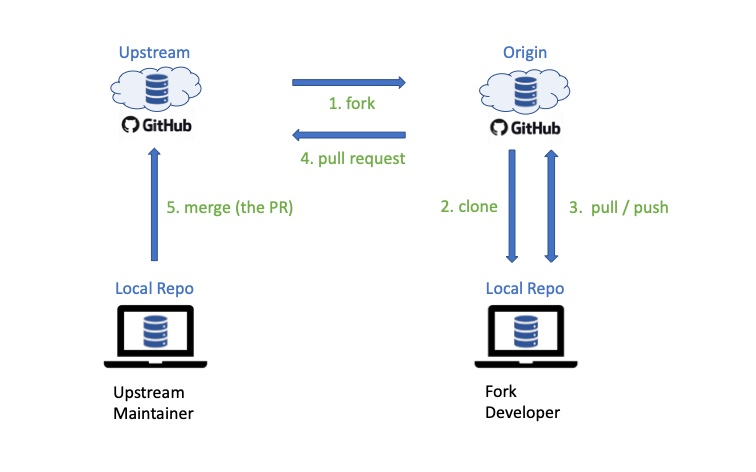

# [Git and Github](https://www.coursera.org/learn/getting-started-with-git-and-github)

## Git and Github fundamental
### Git:
+ free and open source software
+ distributed version control system
+ accessible anywhere in the world
+ one of the most version control systems available
+ can also version control images, documents, etc.
+ focused on tracking source code during development
+ support non-linear workflows

### Github
+ an online hosting service for Git repositories
+ hosted by a subsidiary of Microsoft
+ offers free, professional, and enterprise accounts
+ remark: all source files for a repository are found under **<> Code**

### Glossary of Terms:
+ **SSH protocal** - A method for secure remote login from one computer to another.
+ **Repository** - The folders of your project that are setup for version control. - A data structure for storing documents including application source code.
+ **Fork** - A copy of your repository.
+ **Pull request** - The process you use to request that someone reviews and approves your changes before they become final.
+ **Working directory** - A directory in your file system, including its files and subdirectories, that is associated with a git repository.
+ **Organization** - A collection of user accounts that owns repositories.
+ **License file** - express how people can use your code.

### Basic git commands:
+ `git init` to create a new local repository
+ `git add` to create and add a file to the repo
+ `git status` to check the status of files changed
+ `git commit` to commit changes
+ `git reset`
+ `git log` to check the status of files changed
+ `git branch` to create a branch, get a list of branches and active branch
+ `git checkout` to switch to a branch
+ `git merge` to merge changes in your active branch into another branch
+ `git revert` to revert changes

## Github Workflows with Branches and Git Commands
### GitHub Branches and Pull Requests
+ **Master branch** contains the finished, deployable version of the code
+ Create new branches for changes to code
+ Save changes using **commits**
+ Use **Pull requests** to share code changes for review
+ Merge back into Master when the code is ready to deploy

### Cloning and Forking
*Clone workflow*
*Fork workflow*

### Managing Github Projects
Project roles:
+ Developer: creates code
+ Integrator: receives changes made by others, reviews and responds to pull requests, publishes the result for others to use
+ Repository Administrator: sets up and maintains access to repository by developers

Developer:
+ `git clone` from the upstream to prime the local repository
+ `git pull` and `git fetch` from the ''origin'' to keep up-to-date with the upstream
+ `git push` to share repository
+ `git format patch` to prepare email submission
+ `git send email` to send your email submission
+ `git request pull` to create a summary of changes for your upstream to pull

Integrators:
+ `git am` to apply patches emailed from your contributors
+ `git pull` to merged from your trusted lieutenants
+ `git format patch` to prepare and send sugguested alternative to contributors
+ `git revert` to undo botched commits
+ `git push` to publish the bleeding edge

### SSH key
An SSH key is an access credential in the SSH protocol. Its function is similar to that of user names and passwords, but the keys are primarily used for automated processes. 

To generate an SSH key: `ssh-keygen -t rsa -b 4096 -C "<your email address>"`

## Useful commands
+ `git revert HEAD --no-edit` Sometimes you may not fully test your changes before comitting them and may have undesirable consequences … you can back out your changes by using a git revert command like the following. You can either specify the id of your commit that you can see from the previous log output or use the shortcut **HEAD** to rollback the last commit

## [Additional notes](https://github.com/alannguyencs/pro_git)
