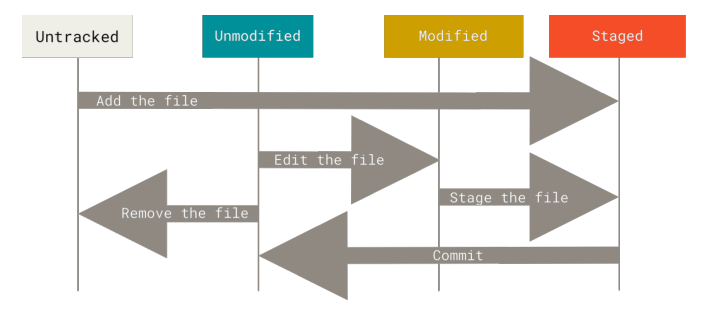

# Git basics
## Get a git repository
 - Initialize a repository in an existing directory: ```git init```
 - Clone an existing repository: ```git clone <url_to_repo>```

*The lifecycle of the status of your files*
## Record changes to the repository
 - Check files status: ```git status```
 - Track new files or stage modified files: ```git add <file_name>```
 - Track all files: ```git add .```
 - Unstage a file: ```git reset <file_name>```
 - Unstage all files: ```git reset```
 - Commit changes: ```git commit - m "text a log message"```
 - Remove unmodified files: ```git rm <file_name>```
 - Remove staging files: ```git rm -f <file_name>```. Be careful that the ```remove``` command will physically remove files in your disk.
 
