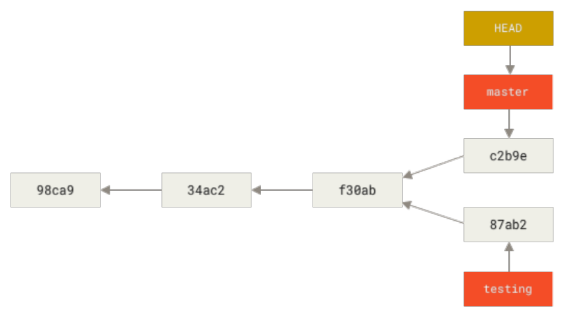
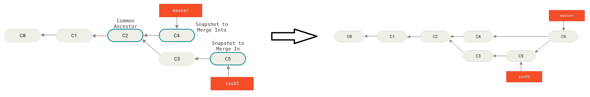

# Git Branching
<br>*Git branching. (98ca9, 34ac2, f30ab, c2b9e, 87ab2) are 
commits along the project history. (master and testing) are two branches originated from two commits 
(c2b9e and 87ab2) respectively. At this moment, the pointer (HEAD) is pointing to branch (master).*

## Branches in a nutshell
 - Create a new branch: ```git branch <branch>```
 - Switch branch: ```git checkout <branch>```
 - Shorthand to create and switch to a new branch: ```git checkout -b <branch>```
 - Create a branch at a tag: ```git checkout -b <branch> <tag>```
 - Create a branch at a commit: ```git checkout -b <branch> <commit>```
 - Delete a branch: ```git branch -d <branch>```
 
 
<br>*Git merging.*
## Git merge
To merge branch (iss53) to (master), Git creates a new snapshot that combines (C4 and C5) and automatically
creates a new commit (C6) that points to it. In case there is a conflict, you have to manually fix and commit it.
To this end, branch master is pointed to (C6).  
 - Suppose (HEAD) is pointing to (master), the merge command: ```git merge <branch>```
 
## Branch management
 - Show branches: ```git branch```
 - Show branches and commits: ```git branch -v```
 - List all tracking files in a branch: ```git ls-tree -r <branch> --name-only```
 
## Remote branches
 - Synchronize your work with a given remote: ```git fetch <remote>```
 - Synchronize + Merge: ```git pull <remote>```
 - Push your data to a remote: ```git push <remote> <branch>```
 - Delete a remote branch: ```git push <remote> --delete <branch>```