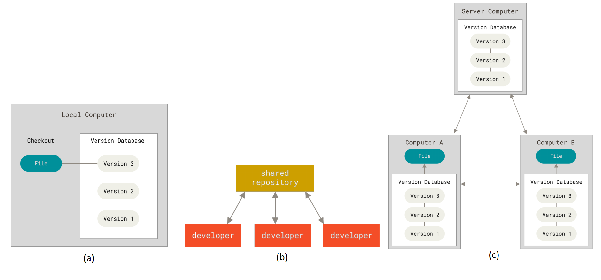

# Version Control



 - Local version control systems
    + (+) You control different versions in a single computer
    + (-) There is no collaboration with other developers
 - Centralized Version Control systems
    + (+) Collaboration among developers
    + (+) Admin controls over who can do what
 - Distributed Version Control systems
    + (+) Flexibility: collaboration among sub-team without submitting minor progress to a central server.

## The three states
 - **Modified:** you modify files in your working tree. 
 - **Staged:** among modified files, you select only those changes that you want to commit.
 - **Committed:** you take a snapshot on the files in staging area.
 
 ## Config
  - Show config: ```git config --list --show-origin```  
  - Update identity: 
    ```sh
    git config --global user.name "Alan Nguyen"
    git config --global user.email alannguyen.cs@gmail.com    
    ```
  - Help: ```git help```
 